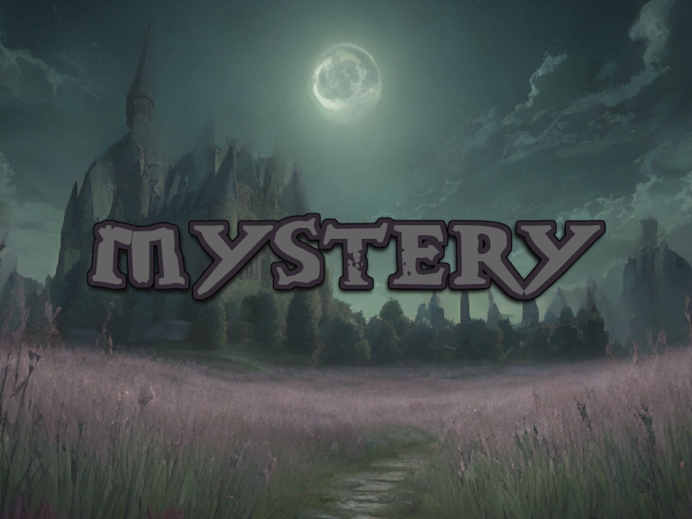

<div style="text-align: center">
    
</div>

# Mystery
A game in the early stage of development.

## How to play?
If you want to try something new, running these commands is enough:
```bash
# You should clone or download this repo first!
git clone ...
cd mystery/
# Create a venv environment is highly recommended.
python3 -m venv .
source bin/active
# Download dependencies.
pip install -r requirements.txt
# Then run the game.
python3 -m mystery
```
